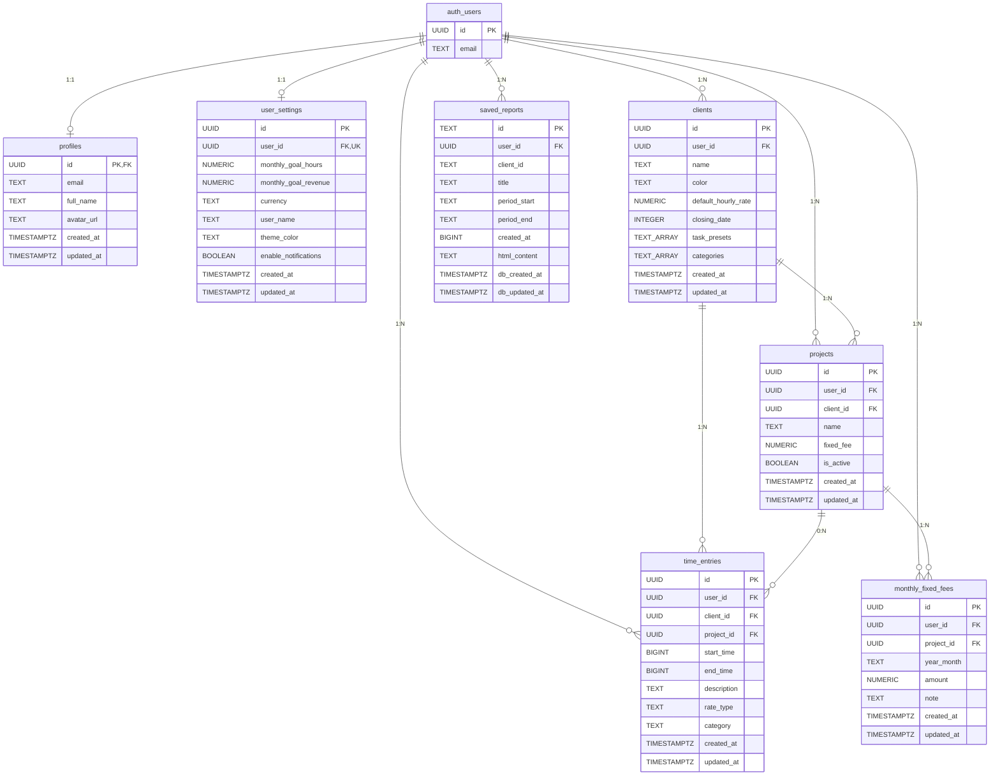

# データモデル

## ER図

## スキーマ定義

### profiles

ユーザープロフィール。Google OAuth サインアップ時にトリガーで自動作成。

| カラム | 型 | 制約 | 説明 |
|---|---|---|---|
| id | UUID | PK, FK→auth.users | ユーザーID |
| email | TEXT | - | メールアドレス |
| full_name | TEXT | - | 表示名 |
| avatar_url | TEXT | - | アバター画像URL |
| created_at | TIMESTAMPTZ | DEFAULT NOW() | 作成日時 |
| updated_at | TIMESTAMPTZ | DEFAULT NOW() | 更新日時（トリガー自動更新） |

### user_settings

ユーザー設定。サインアップ時にデフォルト値で自動作成。

| カラム | 型 | 制約 | 説明 |
|---|---|---|---|
| id | UUID | PK | 設定ID |
| user_id | UUID | FK, UNIQUE | ユーザーID |
| monthly_goal_hours | NUMERIC | DEFAULT 160 | 月間稼働目標（時間） |
| monthly_goal_revenue | NUMERIC | DEFAULT 0 | 月間売上目標 |
| currency | TEXT | CHECK('JPY','USD'), DEFAULT 'JPY' | 通貨 |
| user_name | TEXT | DEFAULT '' | ユーザー名 |
| theme_color | TEXT | DEFAULT 'blue' | テーマカラー |
| enable_notifications | BOOLEAN | DEFAULT true | 通知有効 |
| created_at | TIMESTAMPTZ | DEFAULT NOW() | 作成日時 |
| updated_at | TIMESTAMPTZ | DEFAULT NOW() | 更新日時 |

### clients

クライアント情報。

| カラム | 型 | 制約 | 説明 |
|---|---|---|---|
| id | UUID | PK | クライアントID |
| user_id | UUID | FK, NOT NULL | 所有ユーザー |
| name | TEXT | NOT NULL | クライアント名 |
| color | TEXT | DEFAULT '#3B82F6' | テーマカラー（Hex） |
| default_hourly_rate | NUMERIC | - | デフォルト時給 |
| closing_date | INTEGER | - | 締め日（99=月末, 5/10/15/20/25） |
| task_presets | TEXT[] | DEFAULT '{}' | タスクプリセット |
| categories | TEXT[] | DEFAULT '{}' | 作業カテゴリ |
| created_at | TIMESTAMPTZ | DEFAULT NOW() | 作成日時 |
| updated_at | TIMESTAMPTZ | DEFAULT NOW() | 更新日時 |

### projects

案件情報。クライアントに紐づく。

| カラム | 型 | 制約 | 説明 |
|---|---|---|---|
| id | UUID | PK | 案件ID |
| user_id | UUID | FK, NOT NULL | 所有ユーザー |
| client_id | UUID | FK, NOT NULL | 所属クライアント |
| name | TEXT | NOT NULL | 案件名 |
| fixed_fee | NUMERIC | - | 固定報酬額 |
| is_active | BOOLEAN | DEFAULT true | アクティブ/完了 |
| created_at | TIMESTAMPTZ | DEFAULT NOW() | 作成日時 |
| updated_at | TIMESTAMPTZ | DEFAULT NOW() | 更新日時 |

### time_entries

作業時間エントリ。

| カラム | 型 | 制約 | 説明 |
|---|---|---|---|
| id | UUID | PK | エントリID |
| user_id | UUID | FK, NOT NULL | 所有ユーザー |
| client_id | UUID | FK, NOT NULL | クライアント |
| start_time | BIGINT | NOT NULL | 開始時刻（Unix ms） |
| end_time | BIGINT | - | 終了時刻（null=計測中） |
| description | TEXT | DEFAULT '' | 作業説明 |
| rate_type | TEXT | CHECK('hourly','fixed'), DEFAULT 'hourly' | 報酬タイプ |
| project_id | UUID | FK→projects, ON DELETE SET NULL | 紐づく案件 |
| category | TEXT | - | 作業カテゴリ |
| created_at | TIMESTAMPTZ | DEFAULT NOW() | 作成日時 |
| updated_at | TIMESTAMPTZ | DEFAULT NOW() | 更新日時 |

### monthly_fixed_fees

月次固定報酬。案件単位で月ごとにON/OFF管理。

| カラム | 型 | 制約 | 説明 |
|---|---|---|---|
| id | UUID | PK | フィーID |
| user_id | UUID | FK, NOT NULL | 所有ユーザー |
| project_id | UUID | FK | 対象案件 |
| year_month | TEXT | NOT NULL | 対象月（"2024-01"形式） |
| amount | NUMERIC | NOT NULL | 金額 |
| note | TEXT | - | メモ |
| created_at | TIMESTAMPTZ | DEFAULT NOW() | 作成日時 |
| updated_at | TIMESTAMPTZ | DEFAULT NOW() | 更新日時 |
| | | UNIQUE(user_id, project_id, year_month) | 複合ユニーク |

### saved_reports

保存済みレポート。

| カラム | 型 | 制約 | 説明 |
|---|---|---|---|
| id | TEXT | PK | レポートID |
| user_id | UUID | FK, NOT NULL | 所有ユーザー |
| client_id | TEXT | NOT NULL | クライアントID |
| title | TEXT | NOT NULL | レポートタイトル |
| period_start | TEXT | NOT NULL | 期間開始日 |
| period_end | TEXT | NOT NULL | 期間終了日 |
| created_at | BIGINT | NOT NULL | 作成時刻（Date.now()） |
| html_content | TEXT | NOT NULL | HTML文書 |
| db_created_at | TIMESTAMPTZ | DEFAULT NOW() | DB作成日時 |
| db_updated_at | TIMESTAMPTZ | DEFAULT NOW() | DB更新日時 |

## インデックス

| テーブル | カラム | 用途 |
|---|---|---|
| clients | user_id | ユーザー別クライアント取得 |
| projects | user_id | ユーザー別案件取得 |
| projects | client_id | クライアント別案件取得 |
| time_entries | user_id | ユーザー別エントリ取得 |
| time_entries | client_id | クライアント別エントリ取得 |
| time_entries | start_time | 時系列ソート |
| time_entries | project_id | 案件別エントリ取得 |
| time_entries | category | カテゴリ別エントリ取得 |
| monthly_fixed_fees | user_id | ユーザー別フィー取得 |
| monthly_fixed_fees | year_month | 月別フィー取得 |
| saved_reports | user_id | ユーザー別レポート取得 |
| saved_reports | client_id | クライアント別レポート取得 |

## RLS（Row Level Security）

全テーブルで RLS 有効。各テーブルに SELECT/INSERT/UPDATE/DELETE の4ポリシー:
- SELECT: `auth.uid() = user_id`（自分のデータのみ閲覧可）
- INSERT: `auth.uid() = user_id`（自分のデータのみ作成可）
- UPDATE: `auth.uid() = user_id`（自分のデータのみ更新可）
- DELETE: `auth.uid() = user_id`（自分のデータのみ削除可）

profiles テーブルは `auth.uid() = id` で制御。

## トリガー

- **updated_at 自動更新**: 全テーブル（saved_reports除く）に `update_updated_at_column()` トリガー
- **新規ユーザー自動セットアップ**: `auth.users` への INSERT 時に `handle_new_user()` で profiles と user_settings を自動作成

## フロントエンド型定義（types.ts）

| 型 | 説明 |
|---|---|
| `Currency` | enum: JPY, USD |
| `Client` | クライアント（projects を内包） |
| `Project` | 案件 |
| `TimeEntry` | 作業時間エントリ |
| `UserSettings` | ユーザー設定 |
| `MonthlyFixedFee` | 月次固定報酬 |
| `SavedReport` | 保存済みレポート |
| `AppState` | アプリ全体の状態 |

## ローカルストレージ

- キー: `logmee_data_v16`
- 内容: `AppState` の JSON シリアライズ
- マイグレーション: v12〜v15 からの自動マイグレーション対応
